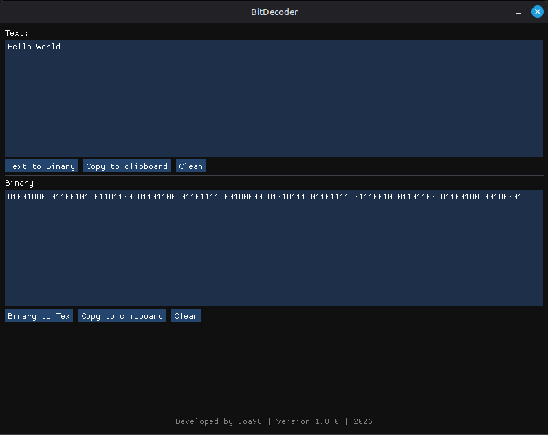

# BitDecoder

BitDecoder is a simple desktop utility built with **C++**, **Dear ImGui**, **GLFW**, and **OpenGL** that allows you to:

* Convert normal text to binary
* Convert binary back to text
* Copy results to the clipboard
* Quickly clear input fields

It is designed as a lightweight, fast, private and easy-to-use tool with a clean graphical interface.

---

## ✨ Features

* Text → Binary conversion
* Binary → Text conversion
* Copy to clipboard buttons
* Clean input fields
* Simple and minimal UI
* Fully offline for the best privacy
* Does not collect any data from the user
* Cross-platform (Linux, Windows, macOS with minor changes)


---

## 🖼️ Screenshot



---

## 🛠️ Build Requirements

- CMake 3.10 or newer
- C++17 compatible compiler
- GLFW
- OpenGL
- Dear ImGui (included in the `external/` directory)

---

## 🔧 Build Instructions (Linux)

```bash
git clone https://github.com/yourusername/BitDecoder.git
cd BitDecoder
mkdir build
cd build
cmake ..
make
./BitDecoder

